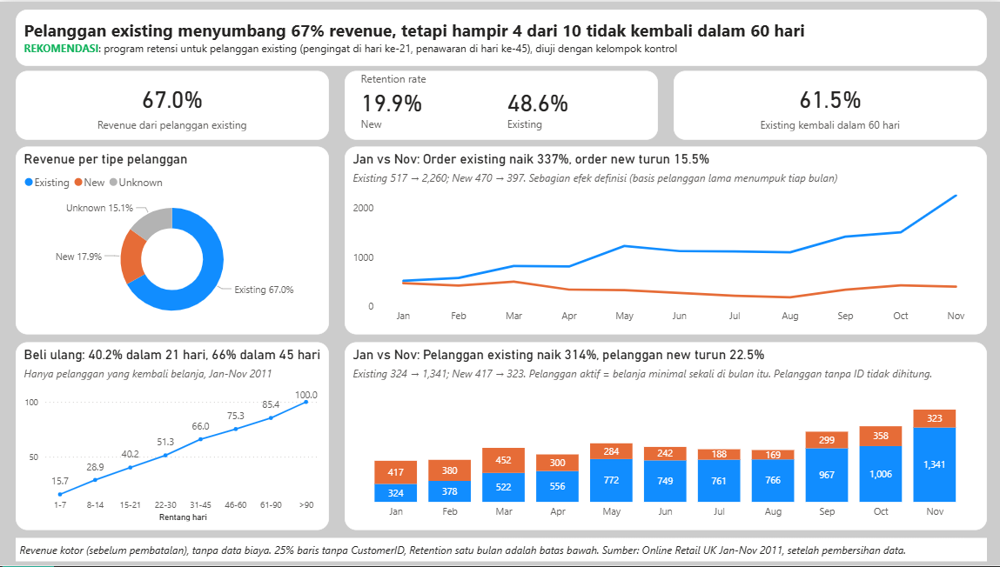
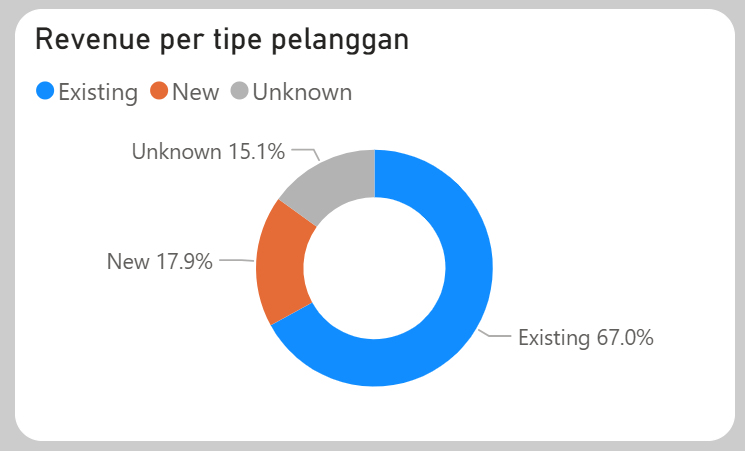
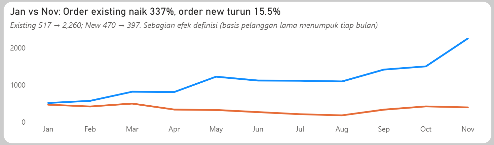
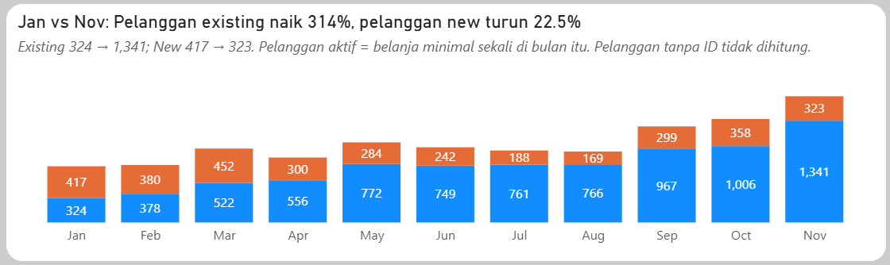
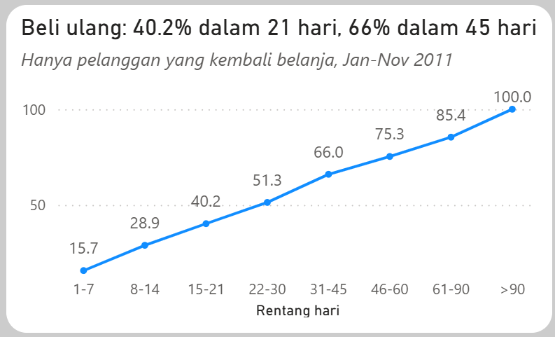

# Pelanggan Lama atau Pelanggan Baru? Analisis Toko Online (Online Retail UK, 2011)

Proyek portofolio analisis data: dari pertanyaan bisnis, pembersihan data dengan SQL, sampai dashboard Power BI dan rekomendasi yang bisa langsung diuji.


<!-- Gambar: tangkapan layar seluruh halaman dashboard Power BI (Page 1) -->

---

## Ringkasan eksekutif

**Pertanyaan:** Kalau ada tambahan anggaran bulan depan, sebaiknya dipakai untuk **mempertahankan pelanggan lama** (retensi) atau **mencari pelanggan baru** (akuisisi)?

**Jawaban:** Fokus ke pelanggan lama.

- Pelanggan lama menyumbang **67%** dari penjualan kotor (Jan-Nov 2011).
- Pelanggan lama yang kembali belanja di bulan berikutnya **48.6%**, jauh lebih tinggi daripada pelanggan baru (**19.9%**).
- Tapi masih ada ruang besar: hampir **4 dari 10** pelanggan lama tidak kembali dalam 60 hari.

**Rekomendasi:** program dua tahap untuk pelanggan lama, yaitu pengingat ringan di hari ke-21 setelah pembelian terakhir dan penawaran khusus di hari ke-45 bagi yang belum kembali. Efeknya diuji dengan **kelompok kontrol**, yaitu sebagian pelanggan yang sengaja tidak dihubungi sebagai pembanding.

---

## Daftar isi

1. [Pertanyaan bisnis](#1-pertanyaan-bisnis)
2. [Data dan istilah](#2-data-dan-istilah)
3. [Membersihkan data](#3-membersihkan-data)
4. [Temuan](#4-temuan)
5. [Rekomendasi](#5-rekomendasi)
6. [Cara mengukur keberhasilan](#6-cara-mengukur-keberhasilan)
7. [Keterbatasan](#7-keterbatasan)
8. [Isi repositori](#8-isi-repositori)
9. [Alat dan kemampuan yang dipakai](#9-alat-dan-kemampuan-yang-dipakai)

---

## 1. Pertanyaan bisnis

Saya berperan sebagai analis untuk manajer e-commerce. Keputusan yang dibantu: **fokus ke retensi atau akuisisi?**

Tiga pertanyaan yang dijawab dengan data:

| # | Pertanyaan | Dugaan awal |
|---|------------|-------------|
| Q1 | Penjualan datang lebih banyak dari pelanggan lama atau baru? | Pelanggan lama lebih dari 50% |
| Q2 | Dari bulan ke bulan, mana yang tumbuh lebih cepat? | Pelanggan lama |
| Q3 | Berapa banyak pelanggan yang kembali belanja, dan kapan biasanya? | Tidak ada dugaan, dihitung dari data |

---

## 2. Data dan istilah

**Sumber:** dataset Online Retail UK, transaksi toko online selama setahun. [tautan sumber data]

| Hal | Isi |
|-----|-----|
| Periode data | 1 Desember 2010 - 9 Desember 2011 |
| Ukuran data mentah | 541,909 baris, 8 kolom (nomor invoice, kode produk, deskripsi, jumlah, tanggal, harga, nomor pelanggan, negara) |
| Satu baris berarti | satu produk dalam satu order |
| Periode analisis | **Januari - November 2011**. Desember 2010 dipakai sebagai "pemanasan" untuk mengetahui siapa yang sudah pernah belanja. Desember 2011 dikeluarkan karena hanya 9 hari. |

**Istilah yang dipakai di laporan ini**

| Istilah | Arti sederhana |
|---------|----------------|
| Pelanggan baru (New) | Pelanggan di **bulan pertama** ia belanja |
| Pelanggan lama (Existing) | Pelanggan di bulan-bulan **setelah** bulan pertamanya |
| Tidak teridentifikasi (Unknown) | Transaksi tanpa nomor pelanggan, jadi tidak diketahui milik siapa |
| Pelanggan aktif | Pelanggan yang belanja **minimal sekali** di bulan itu (dihitung per orang, bukan per order) |
| Retention (pelanggan kembali) | Dari pelanggan aktif bulan ini, berapa persen yang belanja lagi **bulan berikutnya** |
| Revenue kotor | Jumlah barang x harga, **sebelum** retur dikurangkan |

---

## 3. Membersihkan data

Data mentah tidak langsung bisa dipakai. Empat masalah ditemukan dan masing-masing diputuskan perlakuannya:

| Masalah | Jumlah | Perlakuan | Alasan |
|---------|--------|-----------|--------|
| Transaksi tanpa nomor pelanggan | 24.93% baris | **Dipertahankan** sebagai "Tidak teridentifikasi" | Tetap penjualan sungguhan, hanya tidak bisa dilacak per orang |
| Retur (invoice berawalan "C") | 9,288 baris | Dihapus | Ini pengembalian barang, bukan pembelian |
| Jumlah atau harga bernilai 0 atau negatif | 1,336 dan 2,517 baris | Dihapus | Tampak seperti catatan stok gudang (barang rusak, ditemukan, dikoreksi), hampir semuanya tanpa nomor pelanggan |
| Baris kembar persis di semua kolom | 5,268 baris | Dihapus | Dugaan salah catat. Ini asumsi, bukan bukti |

Sebagian baris masuk lebih dari satu kategori, jadi angka di atas tidak dijumlahkan.

**Hasil:** 541,909 baris menjadi **524,878 baris** yang siap dianalisis. Detail langkahnya ada di [`docs/log_cleaning.md`](docs/log_cleaning.md).

---

## 4. Temuan

### Temuan 1: Pelanggan lama menyumbang dua pertiga penjualan


<!-- Gambar: grafik donat "Revenue per tipe pelanggan" dari dashboard -->

Dari total penjualan kotor Jan-Nov 2011 sebesar 9,182,868:

- Pelanggan lama: **67.0%**
- Pelanggan baru: 17.9%
- Tidak teridentifikasi: 15.1%

Kalau hanya dihitung dari pelanggan yang diketahui, pelanggan lama menyumbang 78.9%. Angka 67% adalah batas bawah yang aman: kalau sebagian transaksi tanpa nomor ternyata pelanggan lama, angkanya hanya akan naik.

**Artinya:** bisnis ini bertumpu pada pelanggan yang sudah pernah belanja.

### Temuan 2: Order pelanggan lama naik, order pelanggan baru turun


<!-- Gambar: grafik garis "Jan vs Nov: Order existing naik 337%, order new turun 15.5%" -->

- Order pelanggan lama: 517 di Januari menjadi 2,260 di November (naik 337%).
- Order pelanggan baru: 470 menjadi 397 (turun 15.5%).
- Pelanggan lama tumbuh lebih cepat di 8 dari 10 bulan yang dibandingkan.

**Catatan penting:** sebagian kenaikan ini efek cara kita mendefinisikan. Bayangkan toko membuka buku pelanggan kosong di Desember 2010. Setiap bulan, buku itu makin tebal, jadi daftar "pelanggan lama" otomatis membesar, sementara "pelanggan baru" hanya menghitung yang pertama kali datang bulan itu. Karena itu hasil ini saya sebut **indikasi**, bukan bukti.

### Temuan 3: Pelanggan lama jauh lebih sering kembali


<!-- Gambar: tiga kartu angka di bagian atas dashboard (67.0%, retention 19.9% / 48.6%, 61.5%) -->

Dari 100 pelanggan yang belanja di suatu bulan:

- Pelanggan baru: sekitar **20** yang belanja lagi bulan berikutnya (19.9%).
- Pelanggan lama: sekitar **49** (48.6%).

Angka bulan berikutnya ini sengaja dibaca sebagai batas bawah, karena pelanggan yang baru kembali dua atau tiga bulan kemudian tidak terhitung. Ukuran kedua yang lebih longgar: dari pembelian terakhir, **61.5%** pelanggan lama kembali dalam 60 hari (3,562 dari 5,795 kasus, Jan-Sep 2011). Artinya hampir 4 dari 10 tidak kembali dalam 60 hari.

**Pelajaran:** angka yang sama bisa berbeda jauh tergantung cara menghitungnya, jadi definisi selalu ditulis.

### Temuan 4: Pertumbuhan datang dari jumlah pelanggan, bukan dari orang yang makin sering belanja


<!-- Gambar: grafik batang bertumpuk "Jan vs Nov: Pelanggan existing naik 314%, pelanggan new turun 22.5%" -->

- Pelanggan lama yang aktif: 324 di Januari menjadi 1,341 di November (naik 314%).
- Pelanggan baru yang aktif: 417 menjadi 323 (turun 22.5%).
- Rata-rata order per orang hampir tetap sepanjang tahun: sekitar 1.4-1.7 untuk pelanggan lama dan 1.1-1.2 untuk pelanggan baru.

**Artinya:** pelanggan lama banyak karena jumlahnya menumpuk, bukan karena segelintir orang belanja sangat sering. Di sisi lain, jumlah pelanggan baru per bulan menurun sepanjang tahun, yang menjadi pengingat bahwa pelanggan lama harus dijaga.

### Temuan 5: Kapan pelanggan biasanya kembali?


<!-- Gambar: grafik garis "Beli ulang: 40.2% dalam 21 hari, 66% dalam 45 hari" -->

Dari 11,439 kejadian pelanggan belanja lagi (Jan-Nov 2011), dilihat berapa hari sejak order sebelumnya:

- **40.2%** terjadi dalam 21 hari.
- Sekitar separuh (51.3%) terjadi dalam 30 hari.
- **66.0%** terjadi dalam 45 hari.

**Cara membacanya:** grafik ini hanya menghitung pelanggan yang akhirnya kembali. Pelanggan yang tidak pernah kembali tidak ikut terhitung, jadi angkanya tidak boleh dibaca sebagai "persen pelanggan yang kembali". Angka ini juga tidak membuktikan kapan waktu terbaik menghubungi pelanggan. Grafik ini hanya menunjukkan kapan pembelian ulang biasanya terjadi.

---

## 5. Rekomendasi

**Fokus ke retensi pelanggan lama**, dengan program dua tahap yang dihitung dari pembelian terakhir masing-masing pelanggan:

| Tahap | Kapan | Isi | Kenapa |
|-------|-------|-----|--------|
| 1 | Hari ke-21 setelah pembelian terakhir | Pengingat ringan **tanpa diskon** | Lebih awal dari waktu "biasa" kembali. Biayanya murah, jadi tidak masalah kalau sebagian pelanggan memang akan kembali sendiri |
| 2 | Hari ke-45, bagi yang belum kembali | **Penawaran khusus** | Insentif yang lebih mahal hanya diberikan ke pelanggan yang sudah lebih lambat dari kebanyakan |

Jadwal 21 dan 45 hari adalah **penilaian**, bukan hasil hitungan yang mencari waktu paling optimal. Karena itu program harus diuji dulu (lihat bagian 6).

**Waktu pelaksanaan:** luncurkan sebelum 1 Desember 2011. Hitungannya per pelanggan, jadi program berjalan bergulir. Contoh: pelanggan yang terakhir belanja 30 November mendapat pengingat 21 Desember, dan penawarannya jatuh pada 14 Januari 2012.

**Gambaran dampak (skenario, bukan prediksi):** kalau program menaikkan retention 5 poin persentase, sekitar 50 pelanggan lebih banyak kembali per bulan (dari sekitar 1,000 pelanggan lama aktif). Dengan rata-rata 1.5 order per pelanggan dan nilai sekitar 493 per order, tambahan penjualan kotornya sekitar **37 ribu per bulan**. Ini penjualan, bukan laba, karena data tidak memuat biaya.

---

## 6. Cara mengukur keberhasilan

Supaya jelas apakah program benar-benar bekerja, bukan sekadar kebetulan, dipakai **kelompok kontrol**:

1. Ambil semua pelanggan lama yang memenuhi syarat.
2. Bagi **secara acak** jadi dua kelompok: satu menerima pengingat dan penawaran, satu lagi (kontrol) tidak dihubungi.
3. Bandingkan persentase yang kembali belanja di kedua kelompok. Selisihnya adalah efek program.

Tanpa pembanding, kita tidak bisa membedakan pelanggan yang kembali karena program dari yang memang sudah terbiasa kembali. Data menunjukkan hal itu: tanpa program apa pun, 48.6% pelanggan lama sudah kembali bulan berikutnya.

| Ukuran | Nilai sebelum program (baseline) |
|--------|----------------------------------|
| Pelanggan lama kembali di bulan berikutnya | 48.6% |
| Pelanggan lama kembali dalam 60 hari dari pembelian terakhir | 61.5% |

**Jadwal evaluasi:** hasil awal sekitar akhir Januari 2012, hasil lengkap sekitar akhir Februari 2012. Karena rentangnya melewati musim ramai akhir tahun, kelompok kontrol makin penting.

---

## 7. Keterbatasan

Bagian ini sengaja ditulis jujur:

- **Tidak ada data biaya.** Untung-rugi program tidak bisa dihitung, dan "produk paling menguntungkan" tidak bisa dijawab. Semua angka uang adalah penjualan kotor.
- **Revenue kotor.** Retur tidak dikurangkan dari penjualan.
- **25% baris tanpa nomor pelanggan.** Transaksi ini tidak bisa dilacak per orang, jadi tidak masuk hitungan retention.
- **Definisi pelanggan baru dan lama bergantung pada awal data (Desember 2010).** Pelanggan lama yang kebetulan baru terlihat di data mulai Desember 2010 tercatat "baru". Ini membuat pelanggan lama tampak sedikit lebih kecil, dan sebagian pertumbuhannya adalah efek definisi (lihat Temuan 2).
- **Retention satu bulan adalah batas bawah**, karena pelanggan yang kembali lebih lambat tidak terhitung.
- **Grafik jarak antar order hanya menghitung pelanggan yang kembali.** Datanya tidak bisa menjawab apakah pelanggan yang diam sampai hari ke-45 masih akan kembali.
- **Jadwal hari ke-21 dan ke-45 adalah penilaian.** Efek program belum terbukti sampai diuji dengan kelompok kontrol.
- **Baris kembar dihapus dengan asumsi salah catat.** Kalau sebagian ternyata pembelian sah, penjualan sedikit terlalu rendah (sekitar 1% baris).
- **Hanya setahun data dari satu toko.** Tidak ada pembanding tahun sebelumnya, jadi pola musiman tidak bisa dipastikan.
- **Skenario dampak (+5 poin)** adalah ilustrasi, bukan perkiraan hasil.

---

## 8. Isi repositori

```
.
├── README.md
├── images/                      # gambar yang dipakai di README
├── sql/
│   ├── data_profiling.sql       # mengenal dan memeriksa data mentah
│   ├── cleaning_data.sql        # membersihkan data
│   └── analysis.sql             # query analisis (Q1, Q2, retention, jarak order)
├── docs/
│   └── log_cleaning.md          # catatan setiap langkah pembersihan
├── data/                        # hasil ringkasan (CSV) untuk dashboard
└── dashboard/
    └── online_retail_dashboard.pbix
```

---

## 9. Alat dan kemampuan yang dipakai

- **Excel:** pemeriksaan awal data.
- **SQL (PostgreSQL, DBeaver):** pembersihan data, definisi pelanggan baru/lama, retention, jarak antar order.
- **Power BI:** dashboard satu halaman dengan judul grafik yang menyampaikan kesimpulan.
- **Kerangka analisis:** Ask, Prepare, Process, Analyze, Share, Act.

---

**Dibuat oleh:** Agi Agustian Davi | [AgiAgustianDavi](https://www.linkedin.com/in/agi-agustian-davi/) | [Email](mailto:agidavi6@gmail.com)
